<div align="center">
  

  <h1>Qveris — The Tool OS for AI Agents</h1>

  <p><strong>One unified interface to use 10,000+ tools for your AI agents.</strong></p>
  <p>
  Official Website：<a href="https://qveris.ai" target="_blank"><b>https://qveris.ai</b></a>
  </p>


  <p>
    <b>🇺🇸 English</b> ·
    <a href="README_zh-CN.md">🇨🇳 简体中文</a>
  </p>

  <p>
    <!-- Badges: update URLs/branches as needed -->
    <a href="https://github.com/QverisAI/QverisAI">
      
    </a>
    <a href="https://www.npmjs.com/package/@qverisai/sdk">
      
    </a>
    <a href="https://github.com/QverisAI/QverisAI/actions">
      
    </a>
    <a href="https://github.com/QverisAI/QverisAI/blob/main/LICENSE">
      
    </a>
  </p>
</div>

---

## 📘 Table of Contents

1. [Overview](#-overview)  
2. [Vision & Positioning](#-vision--positioning)  
3. [Why Qveris](#-why-qveris)  
4. [Problems Qveris Solves](#-problems-qveris-solves)  
5. [Architecture](#-architecture)  
6. [Execution Flow](#-execution-flow)  
7. [Quickstart](#-quickstart)  
8. [Tool Schema & Execution Model](#-tool-schema--execution-model)  
9. [Built-in & Ecosystem Tools](#-built-in--ecosystem-tools)  
10. [Publish Your Own Tools](#-publish-your-own-tools)  
11. [Routing & Optimization](#-routing--optimization)  
12. [Developer Ecosystem & Integrations](#-developer-ecosystem--integrations)  
13. [Use Cases](#-use-cases)  
14. [Marketplace & Pricing](#-marketplace--pricing)  
15. [Security & Governance](#-security--governance)  
16. [Comparison](#-comparison)  
17. [Roadmap](#-roadmap)  
18. [Contributing](#-contributing)  
19. [Community](#-community)

---

## 🌐 Overview

Qveris is the **Tool Operating System (Tool OS)** for AI agents.  
It standardizes how LLMs discover and call **10,000+ tools** — web search, OCR, PDF parsing, SaaS APIs, internal services, and business actions — through a **single schema**, a **secure sandbox**, and a **routing engine** that selects the best provider. :contentReference[oaicite:0]{index=0}  

> If LLMs are the brain, Qveris is the hands: safe, reliable, and repeatable.

At a glance:

```text
User → LLM / Agent → Qveris Tool OS → 10,000+ tools / APIs / systems
````

---

## 🎯 Vision & Positioning

**Vision**
Become the global infrastructure layer for AI actions — every agent, model, and AI app executes tools through Qveris.

**Positioning**

* Not another agent framework.
* Not just “plugins”.
* Qveris is the **shared tool layer** underneath agents, LLMs, and SaaS products.

> Think **Kubernetes + Zapier + Homebrew**, but for tools in AI agent ecosystems.

---

## 💡 Why Qveris

### The reality for teams building tool-using agents

| Layer       | Today (without Qveris)                    | With Qveris                                       |
| ----------- | ----------------------------------------- | ------------------------------------------------- |
| Tool schema | Different JSON formats per provider/model | One universal schema                              |
| Integration | Custom wrappers, retries, logging, auth   | Managed integration via Tool OS & SDKs            |
| Execution   | Runs in app servers, no isolation         | Sandbox execution per call                        |
| Routing     | Hard-coded provider choice                | Latency/cost-aware routing & failover             |
| Governance  | Ad-hoc logs and permissions               | Central policies, RBAC & full audit logs          |
| Ecosystem   | Only your own tools                       | **10,000+** tools via built-ins, partners & users |

Without Qveris you rebuild the same infrastructure again and again.
With Qveris you plug into a **tool fabric** that is ready for agents.

---

## 🆘 Problems Qveris Solves

### 1. Fragmented tool ecosystem

```text
OpenAI tools   ≠   LangChain tools   ≠   Zhipu tools   ≠   internal APIs
```

Each has its own format, auth, and error semantics.

Qveris normalizes everything into a **single Tool OS**.

---

### 2. High integration & maintenance cost

Teams repeatedly build:

* API clients & wrappers
* Retry / backoff / rate limiting
* Logging, tracing, metrics
* Permissions & policy enforcement

Qveris centralizes this logic and exposes it through one interface.

---

### 3. Safety & governance gaps

Without a dedicated tool layer:

* Tools can touch any network or DB
* No clear boundary for what a model is allowed to do
* Hard to answer “what exactly did the agent execute?”

Qveris provides:

* Sandbox & firewall
* Access policies & RBAC
* Immutable execution logs & replay

---

## 🏗 Architecture

```text
                          +-----------------------------+
                          |        LLM / Agent          |
                          |  GPT / Claude / Llama ...   |
                          +--------------+--------------+
                                         |
                                   Tool calls (JSON)
                                         |
     +-----------------------------------v----------------------------------+
     |                          Qveris Tool OS                             |
     |---------------------------------------------------------------------|
     |  Tool Registry  |  Schema   |   Sandbox   | Routing  | Logs & ACLs  |
     +---------+-------+-----------+-------------+----------+-------------+
               |                   |             |
        +------v------+      +-----v-----+ +-----v------+
        | Built-in    |      |  Partner  | |  Custom /  |
        | tools       |      | tools     | | enterprise |
        | (core set)  |      |           | | tools      |
        +-------------+      +-----------+ +-----------+
```

Key components:

* **Tool Registry** — metadata, versioning, visibility.
* **Schema Layer** — universal tool interface for all tools.
* **Sandbox** — isolated runtime per invocation.
* **Routing Engine** — chooses providers by latency, reliability, cost, policy.
* **Observability & Governance** — logs, traces, metrics, access control.

---

## 🔁 Execution Flow

### 1. From user to 10,000+ tools

```mermaid
flowchart TB
  %% --- 1. Minimalist Aesthetic Config (CSS) ---
  %% Hide default colors, enforce black & white logic
  linkStyle default stroke:#333,stroke-width:1.5px,fill:none;
  
  %% Node Styles: Pure Black & White
  classDef user fill:#fff,stroke:#000,stroke-width:2px,color:#000,rx:20,ry:20,font-weight:bold;
  classDef component fill:#fff,stroke:#333,stroke-width:1px,color:#333,rx:4,ry:4;
  classDef core fill:#000,stroke:#000,stroke-width:2px,color:#fff,rx:6,ry:6,font-weight:bold;
  classDef tools fill:#f9f9f9,stroke:#ddd,stroke-width:1px,color:#666,rx:2,ry:2,stroke-dasharray: 2 2;
  
  %% Container Style: No border, text only, "Airy" feel
  classDef container fill:none,stroke:none,color:#999,font-size:11px;

  %% --- 2. Node Definitions ---
  U(["👤 User"])
  L["LLM / Agent"]
  Q["⚡ Qveris Tool OS"]

  %% --- 3. Bottom Tool Layer (Forced Grouping) ---
  subgraph ToolLayer ["▼ Tool Ecosystem (10,000+)"]
    direction LR
    %% Invisible links to force horizontal alignment
    T1["Core Tools"] ~~~ T2["SaaS Connectors"] ~~~ T3["Custom Tools"]
  end

  %% --- 4. Connection Logic (The Key to Alignment) ---
  
  %% Main Flow: Straight line down
  U -->|"Request"| L
  L -->|"JSON Call"| Q
  
  %% Alignment Fix: Connect Q only to the MIDDLE node (T2)
  Q -->|"Route & Execute"| T2
  
  %% Auxiliary Lines: Dotted lines to side nodes (visual implication only)
  Q -.-> T1
  Q -.-> T3

  %% --- 5. Apply Styles ---
  class U user;
  class L component;
  class Q core;
  class T1,T2,T3 tools;
  class ToolLayer container;


```



> Behind a single `tool_call`, Qveris can discover, select and execute from **10,000+ tools** across core, partner and user-defined catalogs.

### 2. Inside Qveris

```text
1. Validate tool call against schema
2. Check access policies & RBAC
3. Select provider (routing)
4. Execute in sandbox
5. Collect metrics, logs and traces
6. Return normalized response to the LLM
```

---

## ⚡ Quickstart

The fastest way to use Qveris today is via the **MCP Server SDK** (`@qverisai/sdk`).
It exposes Qveris tools to any MCP-compatible client (Claude Desktop, Cursor, etc).

### 1. Install & run the MCP server

Using `npx`:

```bash
npx @qverisai/sdk
```

Or install globally:

```bash
npm install -g @qverisai/sdk
qveris-mcp
```

You’ll need an API key in `QVERIS_API_KEY`.

---

### 2. Configure your MCP client

**Claude Desktop** (`claude_desktop_config.json`):

```jsonc
{
  "mcpServers": {
    "qveris": {
      "command": "npx",
      "args": ["@qverisai/sdk"],
      "env": {
        "QVERIS_API_KEY": "your-api-key-here"
      }
    }
  }
}
```

**Cursor** (Settings → MCP Servers):

```jsonc
{
  "mcpServers": {
    "qveris": {
      "command": "npx",
      "args": ["@qverisai/sdk"],
      "env": {
        "QVERIS_API_KEY": "your-api-key-here"
      }
    }
  }
}
```

Once connected, your AI assistant can:

1. Discover tools with natural language queries (`search_tools`).
2. Execute any discovered tool with the right parameters (`execute_tool`).

---

## 🧩 Tool Schema & Execution Model

Qveris standardizes every tool with a simple JSON schema.

### Request

```json
{
  "tool": "web.search",
  "input": {
    "query": "AI agents",
    "limit": 5
  }
}
```

### Response

```json
{
  "status": "ok",
  "data": [
    {
      "title": "AI agents in production",
      "url": "https://example.com/...",
      "snippet": "..."
    }
  ],
  "meta": {
    "provider": "provider-id",
    "latency_ms": 412
  }
}
```

All tools follow:

* deterministic input/output contracts
* consistent error semantics
* unified logging & tracing.

---

## 🧰 Built-in & Ecosystem Tools

Qveris provides access to **10,000+ tools** via a layered ecosystem:

### Ecosystem at a glance

| Metric                         | Status (public beta)               |
| ------------------------------ | ---------------------------------- |
| Total tools reachable          | 10,000+ (core + partners + custom) |
| Curated core tools (1st-party) | 100+                               |
| Categories                     | 15+ (search, docs, data, infra, …) |
| Visibility levels              | `private` / `org` / `public`       |

### Layered tool model

| Layer                | Description                                              |
| -------------------- | -------------------------------------------------------- |
| Core built-in tools  | High-quality, curated tools maintained by Qveris         |
| Partner / SaaS tools | Connectors to external APIs and SaaS platforms           |
| Custom / enterprise  | Tools published by users & companies for their own use   |
| Marketplace tools    | Public tools discoverable and reusable by all developers |

### Categories (examples)

| Category     | Example capabilities                             |
| ------------ | ------------------------------------------------ |
| Search       | Web, Arxiv, docs, news                           |
| Web          | HTTP fetch, scraping, sitemap crawling           |
| Documents    | PDF parsing, HTML → text, Office docs            |
| Vision / OCR | Image tagging, OCR engines                       |
| Data         | Weather, finance, crypto, open data APIs         |
| Productivity | Slack, email, calendars, Notion, task tools      |
| Infra        | Storage, queues, databases, generic REST/GraphQL |
| Utilities    | Rate-limited HTTP, batching, formatting, parsing |

---

## 🧩 Publish Your Own Tools

Qveris is not a closed catalog. Any developer or company can **wrap their own APIs as Q-Tools** and plug them into the Tool OS.

We support three visibility levels:

| Visibility | Who can see & use it                    |
| ---------- | --------------------------------------- |
| `private`  | Only you                                |
| `org`      | Your team / company (private registry)  |
| `public`   | Listed on the global Qveris Marketplace |

Typical publishing flow:

```text
1. Implement your tool using the Qveris schema
2. Run `qveris-cli validate` locally
3. Submit the tool manifest to Qveris
4. Choose visibility: private / org / public
5. (Optional) Security & quality review
6. Tool becomes discoverable & executable via Qveris
```

Example manifest (simplified):

```jsonc
{
  "name": "acme-crm.create_customer",
  "version": "1.0.0",
  "visibility": "org",
  "input": {
    "email": "string",
    "full_name": "string"
  },
  "output": {
    "id": "string",
    "status": "string"
  }
}
```

Once published, your tool is:

* discoverable via natural language (`search_tools`)
* executable via `execute_tool`
* fully covered by Qveris sandboxing, routing and logging.

---

## 🧠 Routing & Optimization

Qveris optimizes each call across multiple providers and implementations.

### What we optimize for

| Dimension   | What we track                               |
| ----------- | ------------------------------------------- |
| Latency     | Live request timings                        |
| Reliability | Error rates, retries, circuit-breaker state |
| Cost        | Per-call cost, quotas & budgets             |
| Region      | Data residency & regulatory constraints     |
| Policy      | Provider allow/deny per org/team/tool       |

### Routing pipeline

```text
Tool call
  ↓
Filter providers by policy & region
  ↓
Score providers (latency, reliability, cost)
  ↓
Select primary + fallback chain
  ↓
Execute in sandbox, record metrics
```

As the ecosystem grows, the routing engine scales horizontally — selecting the best option out of **10,000+ tools and endpoints** while keeping a single, simple interface.

---

## 🌱 Developer Ecosystem & Integrations

### Works with your existing agent stack

| Layer         | Examples                               |
| ------------- | -------------------------------------- |
| LLM           | OpenAI, Anthropic, Zhipu, Groq, Llama  |
| Agent runtime | LangChain, LlamaIndex, AutoGen, CrewAI |
| Tool layer    | **Qveris Tool OS**                     |

Use Qveris as the **tool backend**: your agents simply call Qveris tools via MCP today and via HTTP/SDKs in the future.

### Integrations (examples)

| Domain        | Integrations                              |
| ------------- | ----------------------------------------- |
| LLM providers | OpenAI, Anthropic, Zhipu, Groq            |
| Cloud         | AWS, GCP, Azure, Vercel                   |
| Data & Search | Web search, Arxiv, news APIs              |
| Productivity  | Slack, Gmail, calendars, Notion           |
| Infra         | HTTP, REST, GraphQL, storage, DBs, queues |

Because of the unified schema, adding a new provider is primarily defining a new Q-Tool.

---

## 🧪 Use Cases

### 1. AI assistants (consumer & pro)

* Multi-tool personal assistants that search, read, summarize, email, schedule, and more.
* Customer-support copilots pulling data from multiple systems.

### 2. Internal enterprise automation

* CRM bots enriching leads and updating Salesforce / HubSpot.
* Ops bots reconciling data across internal systems.

Qveris provides the guardrails, sandboxing and observability.

---

### 3. Research & knowledge work

* Assistants reading PDFs, searching Arxiv, and generating literature reviews.
* Competitive-intelligence bots monitoring specific topics and sources.

### 4. FinTech & crypto

* Portfolio analysis, market monitoring, alerting bots using financial & crypto tools.

---

## 🛒 Marketplace & Pricing

### Marketplace

The Qveris Marketplace (in development) allows:

* Providers to publish tools
* Developers to monetize capabilities
* Agent builders to discover & plug in tools instantly

Qveris manages billing, execution sandboxing, analytics and abuse control.

### Pricing (subject to change)

| Plan        | Price            | Monthly quota      | Best for                     |
| ----------- | ---------------- | ------------------ | ---------------------------- |
| Free        | $0               | 1,000 calls        | Hobby projects & experiments |
| Developer   | $19 / month      | 50,000 calls       | Indie hackers & solo devs    |
| Pro         | $99 / month      | 1,000,000 calls    | Startups in production       |
| Enterprise  | $499+ / month    | Custom / unlimited | Mid–large organizations      |
| Marketplace | Rev-share 10–30% | —                  | Tool & API providers         |

---

## 🔐 Security & Governance

Security and governance are first-class concerns in Qveris:

* Sandboxed execution environments
* Network & resource-level policies
* RBAC and per-tool access control
* Immutable audit logs & execution IDs
* Rate limiting & quota enforcement
* Enterprise options: VPC, private regions, on-prem (planned)

Compliance roadmap:

* SOC2
* ISO27001
* Industry-specific add-ons (e.g. finance, healthcare)

---

## ⚔ Comparison

### Qveris vs other approaches

| Capability             | Qveris | OpenAI tools | LangChain tools   | Zapier / Make    | Single-provider tools |
| ---------------------- | ------ | ------------ | ----------------- | ---------------- | --------------------- |
| Unified tool schema    | ✅      | ❌ per-model  | ❌ per-integration | ❌ workflow-based | ❌                     |
| LLM-agnostic           | ✅      | ❌            | ✅                 | ❌                | ⚠️ often              |
| Sandbox execution      | ✅      | ⚠️ limited   | ⚠️ user-managed   | ⚠️ per-step      | ⚠️ varies             |
| Multi-provider routing | ✅      | ❌            | ⚠️ manual         | ❌                | ❌                     |
| Marketplace            | ✅      | ❌            | ⚠️ community      | ✅                | ❌                     |
| Enterprise governance  | ✅      | ⚠️ basic     | ❌                 | ⚠️ limited       | ❌                     |

Qveris focuses specifically on **tool unification + routing + governance + ecosystem**, complementing (not replacing) your existing LLM and agent stack.

---

## 🛣 Roadmap

High-level public roadmap (subject to change):

### Q1

* MCP Server SDK (`@qverisai/sdk`) GA
* 50+ core tools
* Routing engine (alpha)

### Q2

* 200+ curated tools
* Marketplace v0
* HTTP & Python SDKs

### Q3

* Multi-region compute & residency settings
* Enterprise admin console
* Custom policy engine

### Q4

* On-prem / VPC deployments
* Compliance certifications
* Visual tool graph editor

For details, see GitHub Issues & Projects.

---

## 🤝 Contributing

We welcome contributions of all kinds:

* New tools & provider integrations
* Bug reports & fixes
* SDK examples for different stacks
* Documentation & tutorials
* Feature proposals and design discussions

**Suggested flow**

1. Fork this repository.
2. Create a feature branch.
3. Add tests where relevant.
4. Open a Pull Request with context & rationale.

A detailed `CONTRIBUTING.md` will be added as the project matures.

---

## 💬 Community

Stay in touch and follow updates:

* 💬 **Discord** — real-time chat & support

  * `https://discord.gg/your-qveris-code`
* 🐦 **X (Twitter)** — product updates & roadmap

  * `https://x.com/QverisAI`
* 💼 **LinkedIn** — company & enterprise news

  * `https://www.linkedin.com/company/qveris`
* 📚 **Docs** — guides & API reference (coming soon)

  * `https://docs.qveris.ai`
* 🧪 **SDK Repository** — MCP server & examples

  * `https://github.com/QverisAI/SDK`

> Replace the placeholder URLs with your actual links when ready.

---

## ⭐ Star & Share

If you believe the world needs a better way for AI to use tools,
please **star this repo** and share it with other builders.

```bash
git clone https://github.com/QverisAI/QverisAI.git
cd QverisAI
# start building with the Tool OS
```
