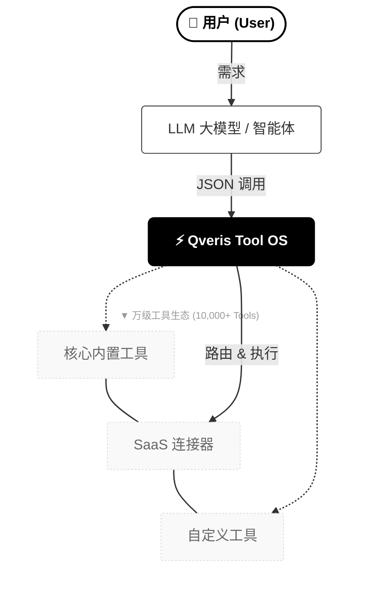

<div align="center">
  

  <h1>Qveris — AI Agent 的工具操作系统（Tool OS）</h1>


  <p><strong>一个统一接口，让你的 AI 使用超过 10,000+ 个工具。</strong></p>
  <p>
  官方网站：<a href="https://qveris.ai" target="_blank"><b>https://qveris.ai</b></a>
  </p>
  <p>
    <a href="README.md">🇺🇸 English</a> ·
    <b>🇨🇳 简体中文</b>
  </p>

  <p>
    <!-- 根据实际情况修改这些链接和分支 -->
    <a href="https://github.com/QverisAI/QverisAI">
      
    </a>
    <a href="https://www.npmjs.com/package/@qverisai/mcp">
      
    </a>
    <a href="https://github.com/QverisAI/QverisAI/actions">
      
    </a>
    <a href="https://github.com/QverisAI/QverisAI/blob/main/LICENSE">
      
    </a>
  </p>
</div>

---

## 📘 目录

1. [概述](#-概述)  
2. [愿景与定位](#-愿景与定位)  
3. [为什么是 Qveris](#-为什么是-qveris)  
4. [Qveris 解决的核心问题](#-qveris-解决的核心问题)  
5. [系统架构](#-系统架构)  
6. [执行流程：从用户到 10,000+ 工具](#-执行流程从用户到-10000-工具)  
7. [快速开始](#-快速开始)  
8. [工具 Schema 与执行模型](#-工具-schema-与执行模型)  
9. [内置工具与生态工具](#-内置工具与生态工具)  
10. [发布你的自定义工具](#-发布你的自定义工具)  
11. [路由与智能调度](#-路由与智能调度)  
12. [开发者生态与集成](#-开发者生态与集成)  
13. [典型应用场景](#-典型应用场景)  
14. [Marketplace 与定价](#-marketplace-与定价)  
15. [安全与治理](#-安全与治理)  
16. [与其他方案的对比](#-与其他方案的对比)  
17. [产品路线图](#-产品路线图)  
18. [如何参与贡献](#-如何参与贡献)  
19. [社区与联系](#-社区与联系)

---

## 🌐 概述

Qveris 是一个 **面向 AI Agent 的工具操作系统（Tool OS）**，为大模型提供统一的工具调用层。

它将搜索引擎、OCR、PDF 解析、各类 SaaS API、企业内部系统和业务动作，统一到：

- **一个标准的工具 Schema**
- **一个安全可控的沙盒执行环境**
- **一个智能多提供商路由引擎**
- **一个覆盖 10,000+ 工具的生态层** 

> 如果说 LLM 是“大脑”，那 Qveris 就是“手脚”。  
> 你只需发出一个 `tool_call`，其余交给 Qveris。

整体调用链路可以概括为：

```text
User → LLM / Agent → Qveris Tool OS → 10,000+ 工具 / API / 系统
````

---

## 🎯 愿景与定位

### 愿景

成为 **全球 AI 工具层的基础设施**：
无论使用哪家模型、哪种 Agent 框架，执行工具时都默认通过 Qveris。

### 定位

Qveris 不是：

* ❌ 又一个 Agent 框架
* ❌ 只能在某个模型里使用的插件系统

Qveris 是：

> **位于所有 LLM / Agent 下游的「工具操作系统」** —— 统一工具接口、统一执行环境、统一治理与生态。

可以类比为：

> **Kubernetes + Zapier + Homebrew，但专门服务于 AI 工具和 Agent。**

---

## 💡 为什么是 Qveris

今天你在构建一个「会用工具的 Agent」时，通常会遇到：

| 层级        | 没有 Qveris 时             | 引入 Qveris 之后        |
| --------- | ----------------------- | ------------------- |
| 工具 Schema | 各家模型各有一套 JSON 规范        | 统一工具 Schema         |
| 工具集成      | 为每个 API 写 wrapper、重试、日志 | 标准化工具模块，可复用         |
| 执行环境      | 直接在应用服务器执行，缺乏隔离         | 沙盒执行，每次调用独立         |
| 路由能力      | 手动选 provider、写 if/else  | 智能路由 + Fallback     |
| 权限治理      | 几乎没有：谁都能调用              | RBAC、策略、配额、审计       |
| 工具生态      | 只能用自己接的几个               | 一次接入，立刻获得 10k+ 工具能力 |

总结一句话：

> **没用 Qveris，你在重复造“工具基础设施”的轮子；
> 用了 Qveris，你直接接入的是一个成熟的 Tool OS。**

---

## 🆘 Qveris 解决的核心问题

### 1. 工具生态碎片化

```text
OpenAI Tools  ≠  LangChain Tools  ≠  Zhipu 工具  ≠  企业内 API
```

每家格式不同、参数不同、错误语义不同，难以复用。
Qveris 用统一的 Tool Schema 做“抽象层”，把这些差异全部收敛。

---

### 2. 集成与维护成本极高

团队反复为每个工具写：

* 授权 / 鉴权
* 错误重试 / 限流 / 熔断
* 日志 / 监控 / 指标
* 参数校验 / 数据清洗

Qveris 将这些通用能力放在 Tool OS 内部，业务只关注：
**“我需要一个什么能力的工具？”**

---

### 3. 缺乏安全边界与治理能力

当 Agent 直接调用外部或内部系统时，风险包括：

* 任意发起 HTTP 请求
* 任意访问数据库 / 文件系统
* 行为不可追踪，不可审计

Qveris 内建：

* 执行沙盒 + 网络策略
* 工具级与团队级 RBAC
* 全链路审计日志与执行 ID
* 企业级限流与配额控制

---

## 🏗 系统架构

```text
                          +-----------------------------+
                          |        LLM / Agent          |
                          |  GPT / Claude / Llama ...   |
                          +--------------+--------------+
                                         |
                                   tool_call (JSON)
                                         |
     +-----------------------------------v----------------------------------+
     |                          Qveris Tool OS                             |
     |---------------------------------------------------------------------|
     |  Tool Registry  |  Schema   |   Sandbox   | Routing  | Logs & ACLs  |
     +---------+-------+-----------+-------------+----------+-------------+
               |                   |             |
        +------v------+      +-----v-----+ +-----v------+
        | 官方内置工具  |      | 合作伙伴工具 | | 企业/自定义工具 |
        | (核心 100+) |      | (SaaS API) | | (私有 / 公开)    |
        +-------------+      +-----------+ +-----------+
```

核心组件：

* **Tool Registry**：工具注册表与元数据管理
* **Schema Layer**：统一输入/输出格式
* **Sandbox**：安全执行环境与资源隔离
* **Routing Engine**：多 provider 智能路由
* **Logs & ACLs**：日志、追踪、权限与策略管理

---

## 🔁 执行流程：从用户到 10,000+ 工具



> 一个简单的 `tool_call` 背后，是 Qveris 在 **10,000+ 工具池**中进行发现、筛选、调度与执行的完整闭环。

---

## ⚡ 快速开始

目前最推荐的接入方式是使用 **MCP Server SDK：`@qverisai/mcp`**，
可直接接入 Claude Desktop、Cursor 等支持 MCP 的客户端。

### 1. 安装 & 启动 MCP Server

使用 `npx`：

```bash
npx @qverisai/mcp
```

或全局安装：

```bash
npm install -g @qverisai/mcp
qveris-mcp
```

在环境变量中注入：

```bash
export QVERIS_API_KEY=your_api_key
```

---

### 2. 在 Claude Desktop 中配置

编辑 `claude_desktop_config.json`：

```jsonc
{
  "mcpServers": {
    "qveris": {
      "command": "npx",
      "args": ["@qverisai/mcp"],
      "env": {
        "QVERIS_API_KEY": "your-api-key-here"
      }
    }
  }
}
```

配置完成后，你的 Claude 就可以：

1. 用自然语言搜索可用工具（`search_tools`）
2. 自动选定并调用合适的工具（`execute_tool`）

---

## 🧩 工具 Schema 与执行模型

Qveris 使用统一的 JSON Schema 来描述所有工具。

### 调用请求示例

```json
{
  "tool_id": "openweathermap_current_weather",
  "search_id": "2f06d73c-164c-4a20-82a4-20f1afdd49f8",
  "params_to_tool": "{\"city\": \"London\", \"units\": \"metric\"}"
}
```

### 返回结果示例

```json
{
  "execution_id": "exec-123",
  "tool_id": "openweathermap_current_weather",
  "success": true,
  "result": {
    "data": {
      "temperature": 15.5,
      "humidity": 72,
      "description": "partly cloudy"
    }
  },
  "execution_time": 0.447
}
```

特点：

* 输入 / 输出结构稳定可预期
* 提供商可替换（多 provider 路由）
* 错误语义统一，便于 Agent 处理
* 具备完整元数据与追踪信息

---

## 🧰 内置工具与生态工具

Qveris 的工具生态按层级构建：

### 工具生态概览

| 指标           | 当前状态（公测）                     |
| ------------ | ---------------------------- |
| 可达工具总数       | 10,000+                      |
| 官方精选工具（核心一方） | 100+                         |
| 工具类别         | 15+（搜索 / 文档 / 数据等）           |
| 可见性级别        | `private` / `org` / `public` |

### 工具分层模型

| 层级             | 描述                  |
| -------------- | ------------------- |
| 官方内置工具         | 由 Qveris 官方维护的高质量工具 |
| 合作伙伴 / SaaS 工具 | 通过连接器接入的第三方能力       |
| 企业与自定义工具       | 由企业或开发者封装的内部 / 专用工具 |
| Marketplace 工具 | 在公开市场中可被任何人复用的工具    |

### 典型工具类别

* 搜索（Web、学术、新闻）
* 文档处理（PDF、HTML、Office 文档）
* OCR / 视觉处理
* 数据服务（天气、金融、加密货币、公开数据）
* 协同与效率（Slack、Email、Calendar、Notion 等）
* 基础设施（HTTP、REST、GraphQL、DB、队列等）

---

## 🧩 发布你的自定义工具

Qveris 不是一个封闭工具库，而是一个 **可扩展的工具生态**。

你可以将自己的 API / 业务逻辑封装为 Q-Tool，并选择：

* `private`：仅自己可用
* `org`：团队 / 公司内部使用
* `public`：在 Qveris Marketplace 中公开

### 发布流程

```text
1. 按 Qveris 工具 Schema 实现你的工具
2. 使用 qveris-cli 进行本地校验
3. 提交工具清单（manifest）
4. 选择可见性：private / org / public
5. （可选）通过安全与质量审核
6. 工具即可被 Agent 搜索和调用
```

### Manifest 示例（简化版）

```jsonc
{
  "name": "acme-crm.create_customer",
  "version": "1.0.0",
  "visibility": "org",
  "input": {
    "email": "string",
    "full_name": "string"
  },
  "output": {
    "id": "string",
    "status": "string"
  }
}
```

---

## 🧠 路由与智能调度

Qveris 在调用工具时会基于多维度进行智能路由：

| 维度  | 含义                |
| --- | ----------------- |
| 延迟  | 实时请求耗时            |
| 稳定性 | 错误率 / 超时 / 熔断状态   |
| 成本  | 调用费用与配额消耗         |
| 区域  | 数据合规与地域限制         |
| 策略  | 组织 / 团队级允许 / 禁止规则 |

路由流水线：

```text
tool_call
  ↓
按策略与区域筛选可用 provider
  ↓
按延迟、稳定性、成本进行评分
  ↓
选择主 provider 与 Fallback 链路
  ↓
在沙盒中执行并采集指标
```

随着生态扩展，路由引擎可在 **10,000+ 工具与端点** 中持续寻找最优路径。

---

## 🌱 开发者生态与集成

### 与主流 Agent 堆栈的关系

| 层级            | 示例                                        |
| ------------- | ----------------------------------------- |
| LLM           | OpenAI / Anthropic / Zhipu 等              |
| Agent Runtime | LangChain / LlamaIndex / CrewAI / AutoGen |
| Tool Layer    | **Qveris Tool OS**                        |

Qveris 不替代这些框架，而是为它们提供 **统一、高质量的工具能力**。

### 典型集成能力

* LLM provider：OpenAI、Anthropic、Zhipu、Groq、Llama 等
* 云平台：AWS / GCP / Azure / Vercel 等
* 企业 SaaS：CRM、客服、协同办公相关系统
* 内部 API：通过自定义工具接入企业内部系统

---

## 🧪 典型应用场景

### 1. 通用 AI 助手 / Copilot

* 同时完成搜索、阅读文档、写邮件、安排日程等复杂任务
* 背后全部通过 Qveris 统一调度工具

### 2. 企业内部自动化 Agent

* 自动从多个系统读取/写入数据（CRM / ERP / 财务 / 运维）
* Qveris 提供安全边界与全链路审计

### 3. 研究与知识工作

* 文献检索 → PDF 解析 → 笔记整理 → 报告输出
* 多数据源统一封装为工具，便于 Agent 调用

### 4. 金融 / Crypto 场景

* 组合分析、市场监控、风控预警
* 统一接入不同交易所 / 数据提供商工具

---

## 🛒 Marketplace 与定价

### Marketplace

Qveris Marketplace 将支持：

* API / 工具提供方发布自己的工具
* 根据调用量或订阅模式进行变现
* Agent 构建者按需发现与接入工具

Qveris 负责：

* 计费与分账
* 沙盒执行与安全治理
* 使用数据与分析面板

### 定价（示意）

> 具体价格以官网为准，以下为示例结构。

| 方案          | 价格          | 月调用量        | 适用场景        |
| ----------- | ----------- | ----------- | ----------- |
| Free        | $0          | 1,000 次     | 个人体验 / Demo |
| Developer   | $19 / 月     | 50,000 次    | 独立开发者       |
| Pro         | $99 / 月     | 1,000,000 次 | 初创公司生产环境    |
| Enterprise  | $499+ / 月   | 自定义 / 无限    | 中大型企业       |
| Marketplace | 收入分成 10–30% | —           | 工具/数据提供方    |

---

## 🔐 安全与治理

安全与治理是 Qveris 的一等公民：

* 沙盒执行环境（隔离网络与资源）
* 工具级与团队级 RBAC 权限控制
* 不可篡改的审计日志与执行 ID
* 调用限流、配额与预算策略
* 企业级部署选项（VPC / 私有云 / On-Prem 规划中）

合规方向：

* SOC2
* ISO27001
* 行业特定合规扩展（如金融、医疗等）

---

## ⚔ 与其他方案的对比

| 能力              | Qveris | OpenAI Tools | LangChain Tools | Zapier / Make | 单一 API / 自建 |
| --------------- | ------ | ------------ | --------------- | ------------- | ----------- |
| 统一工具 Schema     | ✅      | ❌            | ❌               | ❌             | ❌           |
| 统一访问 10k+ 工具    | ✅      | ❌            | ❌               | ❌             | ❌           |
| LLM 无关性         | ✅      | ❌            | ✅               | ❌             | ⚠️ 视实现而定    |
| 沙盒执行与安全边界       | ✅      | ⚠️ 有限        | ⚠️ 需自建          | ⚠️ 步骤级        | ❌           |
| 多 provider 智能路由 | ✅      | ❌            | ⚠️ 手动           | ❌             | ❌           |
| 开放 Marketplace  | ✅      | ❌            | ⚠️ 社区插件         | ✅             | ❌           |
| 企业级治理与审计        | ✅      | ⚠️ 基础        | ❌               | ⚠️ 有限         | ❌           |

Qveris 专注于：**工具统一 + 路由优化 + 安全治理 + 生态增长**，
并与现有 LLM / Agent 框架形成互补，而非替代关系。

---

## 🛣 产品路线图

> 以下为公开路线图方向，具体以项目进度为准。

### Q1

* MCP Server（`@qverisai/mcp`）稳定发布
* 50+ 官方内置工具
* 路由引擎 Alpha 版本

### Q2

* 200+ 官方精选工具
* Qveris Marketplace v0
* HTTP / Python SDK

### Q3

* 多区域部署与数据驻留策略
* 企业管理控制台
* 自定义策略引擎（Policy Engine）

### Q4

* On-Prem / VPC 部署方案
* 合规认证（SOC2 / ISO 等）
* 可视化 Tool Graph Editor

更多细节可参考 GitHub Issues 与 Projects。

---

## 🤝 如何参与贡献

我们欢迎各种形式的贡献，包括但不限于：

* 新工具与 Provider 集成
* Bug 报告与修复
* SDK 示例与最佳实践
* 文档与教程
* 新特性建议与设计讨论

推荐流程：

1. Fork 本仓库
2. 创建功能分支
3. 编写 / 更新测试
4. 提交 Pull Request，并说明背景与动机

未来会补充更详细的 `CONTRIBUTING.md`。

---

## 💬 社区与联系

欢迎加入社区，获取最新进展与技术支持：

* 💬 **Discord** — 实时讨论与技术问答

  * `https://discord.gg/your-qveris-code`
* 🐦 **X（Twitter）** — 产品更新与路线图

  * `https://x.com/QverisAI`
* 💼 **LinkedIn** — 公司与企业级动态

  * `https://www.linkedin.com/company/qveris`
* 📚 **文档站（Docs）** — 使用指南与 API 参考（建设中）

  * `https://docs.qveris.ai`
* 🧪 **SDK 仓库** — MCP Server SDK 与示例

  * `https://github.com/QverisAI/SDK`

> 将以上链接替换为你的真实链接即可直接对外使用。

---

## ⭐ 为 Qveris 点亮一颗星

如果你认同「AI 需要一个真正的工具操作系统」，
欢迎为 Qveris 点亮一颗 ⭐，并分享给更多构建 Agent 的开发者。

```bash
git clone https://github.com/QverisAI/QverisAI.git
cd QverisAI
# 开始基于 Qveris Tool OS 构建你的下一个 Agent
```
